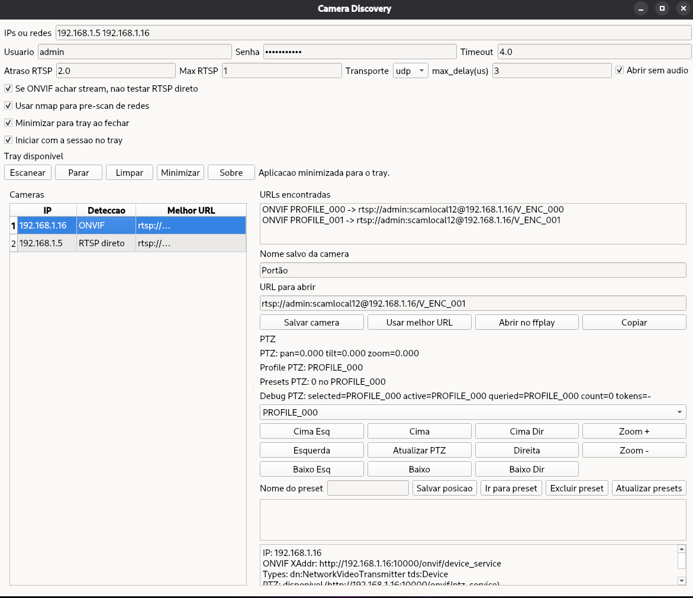

# Camera Discovery & Viewer

[Português](#português) | [English](#english)

---

## English

A powerful Linux utility to skip the headache of manually finding RTSP URLs. It automates the discovery of ONVIF and RTSP cameras, allowing instant verification via `ffplay`.

### Why use this?
- **For CCTV Installers:** Quickly verify if cameras are online and accessible without a heavy VMS.
- **For Self-Hosters:** Find the exact RTSP paths for Home Assistant, Scrypted, or Frigate.
- **Smart Discovery:** It doesn't just scan ports; it negotiates ONVIF profiles to find the highest quality stream and has an exhaustive fallback for non-standard RTSP paths.

### Key Features


*Main Interface*

- **Smart Probe:** Attempts ONVIF first (profiles/stream URI) with a conservative RTSP fallback.
- **Network Scanning:** Scan specific IPs or entire CIDR networks (uses `nmap` for speed if available).
- **Interactive:** Edit URLs on the fly before launching the viewer.
- **Persistence:** Remembers your settings and last scan results.
- **System Tray:** Runs in the background with a native tray icon.

### How to Use
1. **Target:** Enter an IP, list of IPs, or a CIDR range (e.g., `192.168.1.0/24`).
2. **Scan:** Click **Scan**. The tool will identify brands and available streams.
3. **View:** Double-click or click **Play** to open the stream in `ffplay`.

### Compatibility
Tested and working with major brands: **Hikvision, Dahua, Intelbras, TP-Link (Tapo/VIGI), Reolink, and generic XMeye/ONVIF devices.**

### Installation & Development

1. **Setup Environment**:
   ```bash
   python -m venv venv
   source venv/bin/activate
   pip install -r requirements-gui.txt
   ```

2. **Run**:
   ```bash
   python camera_discovery_gui.py
   ```

3. **Build Binary**:
   ```bash
   ./build_app.sh
   ```

### Requirements
- `ffplay` (ffmpeg) must be installed for viewing.
- `nmap` (optional, for faster discovery).

---

## Português

Uma ferramenta poderosa para Linux que elimina a dor de cabeça de encontrar URLs RTSP manualmente. Automatiza a descoberta de câmeras ONVIF e RTSP, permitindo verificação instantânea via `ffplay`.

### Por que usar?
- **Uso Doméstico:** Abra e monitore as câmeras de segurança da sua casa diretamente no seu desktop Linux.
- **Instaladores de CFTV:** Verifique rapidamente se as câmeras estão online e acessíveis sem precisar de um VMS pesado.
- **Usuários de Smart Home:** Encontre os caminhos RTSP exatos para integrar no Home Assistant, Scrypted ou Frigate.
- **Descoberta Inteligente:** Não apenas varre portas; negocia perfis ONVIF para obter a melhor qualidade e possui um fallback exaustivo para caminhos RTSP fora do padrão.

### Recursos


*Interface Principal*

- **Sonda Inteligente:** Tenta ONVIF primeiro (perfis/stream URI) com fallback RTSP conservador.
- **Varredura de Rede:** Aceita IPs individuais ou redes CIDR (usa `nmap` para acelerar, se disponível).
- **Interativo:** Permite editar URLs manualmente antes de abrir o player.
- **Persistência:** Salva configurações e o último resultado automaticamente.
- **Bandeja do Sistema:** Ícone nativo na tray para execução em segundo plano.

### Como Usar
1. **Alvo:** Insira um IP, lista de IPs ou rede CIDR (ex: `192.168.1.0/24`).
2. **Scan:** Clique em **Scan**. A ferramenta identificará marcas e streams disponíveis.
3. **Ver:** Clique duas vezes ou em **Play** para abrir o vídeo no `ffplay`.

### Compatibilidade
Testado com as principais marcas: **Hikvision, Dahua, Intelbras, TP-Link (Tapo/VIGI), Reolink e dispositivos genéricos XMeye/ONVIF.**

### Executar em desenvolvimento

```bash
./venv/bin/python camera_discovery_gui.py
```

### Empacotar (Gerar .deb)

```bash
chmod +x build_app.sh build_deb.sh
./build_app.sh
./build_deb.sh
```

O pacote instala o launcher em `/usr/bin/camera-discovery` e configura o autostart global.

### Observações
- `ffplay` precisa estar instalado no sistema.
- Câmeras sensíveis podem travar com sondas muito rápidas; a GUI possui atraso configurável entre tentativas.

### License
This project is licensed under the GNU General Public License v3.0.

---
**Author:** Henrique Fernandes Silveira - [henriquefsilveira@gmail.com](mailto:henriquefsilveira@gmail.com)
